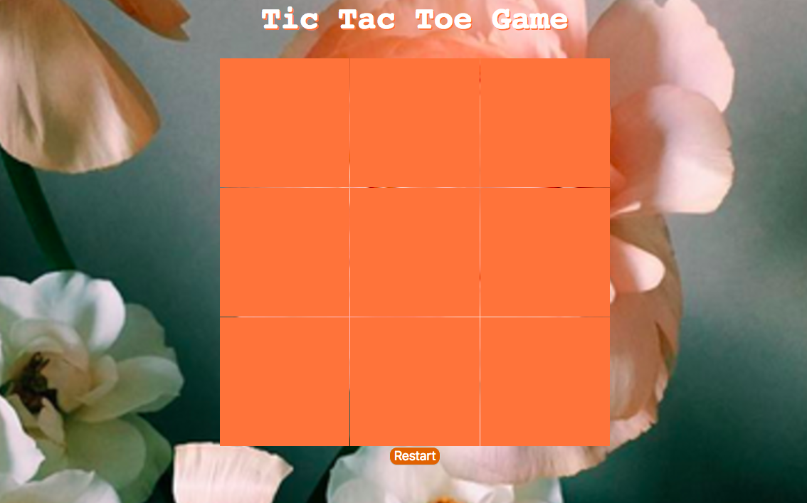

# **Tic Tac Toe** 

# **Enjoy Playing This X and O Game.** 

## Technology: 
HTML. 
CSS. 
Jquiery. 

## Features: 
I used an Clap audio  when either X or O win the Game. 
user can see whose turn is now . 

## Game logic: 
The first player will always start with X . 
There second Player will be O. 
There is a function to check if we have a winner, consists of all the probability to win. 
If there is a winner will shows an alert message with clapping . 
when the board is full and no one reach the win positions , alert will tell the players they got a tie game("Try Again). 

## Improvments:  
1.Online players. 
2.Add multiple levels. 

## Credits: 
1.[SweetAlert.com](www.sweetalert.js.org) 
2.[W3Schools.com](www.w3schools.com) 
3.[stackoverflow.com](www.stackoverflow.com) 
4.And special Thanks to my Instructors (Micheal , Usman and Moath).
